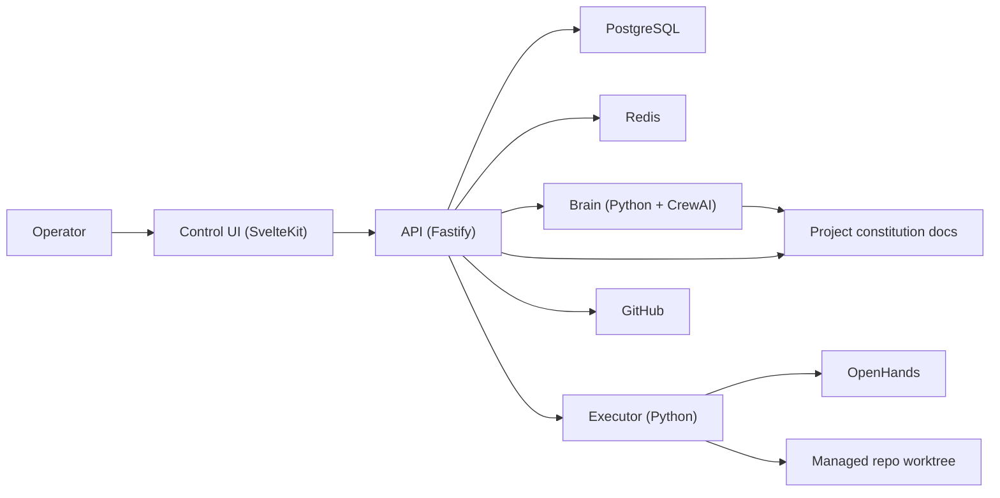

# yeet2 Architecture

## Overview

yeet2 is a self-hosted autonomous software factory control plane.

It is organized as a monorepo with four primary runtime services:

- `apps/control`
- `apps/api`
- `apps/brain`
- `apps/executor`

Supporting packages and infrastructure provide durable state, constitution parsing, shared domain types, and deployment packaging.

## Service Map

## Monorepo Layout

- `apps/control`
  Operator-facing web control plane.
- `apps/api`
  Core HTTP API, persistence coordination, autonomy loop, GitHub integration, and control-plane orchestration glue.
- `apps/brain`
  Planning service. CrewAI-first with explicit failure when Brain/CrewAI is selected and unavailable.
- `apps/executor`
  Job execution service with yeet2-owned workspace policy and OpenHands behind an adapter boundary.
- `packages/domain`
  Shared domain types.
- `packages/db`
  Prisma schema and DB client ownership.
- `packages/constitution`
  Constitution inspection and parsing helpers.
- `infra/docker`
  Container packaging and single-host deployment assets.
- `infra/nomad`
  Placeholder for future distributed fabric packaging.

## Runtime Responsibilities

### Control

Control is the operator surface.

Responsibilities:

- present the system state clearly
- expose project-level start/stop/supervised controls
- show queues for approvals, blockers, jobs, tasks, and missions
- render project detail, agent state, and project chat
- stay API-first so the UI can be rebuilt without changing backend behavior

### API

API is the center of the implemented MVP.

Responsibilities:

- register and hydrate projects
- persist constitutions, missions, tasks, jobs, blockers, and workers
- trigger Brain planning
- dispatch work to the Executor
- run the autonomy loop
- integrate with GitHub for blockers, PRs, merge state, and repo metadata
- expose queue-style read models for Control

### Brain

Brain is the planning subsystem.

Responsibilities:

- read constitution-backed planning context
- turn project intent into missions and tasks
- use CrewAI role definitions and model selection
- fail loudly when CrewAI-backed planning is selected but unavailable
- provide deterministic fallback only when explicitly configured

### Executor

Executor is the execution boundary.

Responsibilities:

- create isolated worktrees/branches
- run implementation, QA, and review jobs
- persist logs and artifact summaries
- report worker identity and job state back to the API
- support sandbox evolution through ASRT/sharkcage-style wrapping
- keep OpenHands behind a yeet2-owned adapter interface

## Data Model

Primary durable objects:

- Project
- Constitution
- Mission
- Task
- Job
- Blocker
- Worker
- Decision log / chat message
- Role definition

These objects are stored in PostgreSQL and exposed through API summaries optimized for the Control UI.

## Interaction Model

yeet2 intentionally separates:

- durable project state
- orchestration intelligence
- execution runtime
- operator interaction

This keeps the system replaceable in the right places:

- Brain can evolve beyond CrewAI
- Executor backends can evolve beyond OpenHands
- Fabric can evolve from local workers toward Nomad
- Control can evolve visually without redefining backend behavior

## Project Chat And Handoffs

Project chat is durable state, not an ephemeral UI layer.

Messages are stored in PostgreSQL decision logs and support:

- operator guidance
- agent working updates
- handoff messages
- directive-style baton passes
- `@role`
- `@staff-member`
- `@reply`

Targeted messages are actionable by default only for the addressed role or reply target. Broadcast visibility does not imply that every agent should respond.

## Deployment Modes

### Local development

- local infra via `docker compose`
- app services run directly from the repo

### Single-host deployment

- `docker-compose.deploy.yml`
- builds on-host
- current dogfood target is `10.42.10.101`

### Release deployment

- `docker-compose.release.yml`
- pulls prebuilt images from GHCR

## Future Direction

The current architecture is intentionally shaped so these upgrades are incremental rather than rewriting the system:

- stronger sandboxing
- richer CrewAI orchestration beyond planning
- distributed fabric / Nomad
- more GitHub-native lifecycle automation
- improved auth and operator controls
