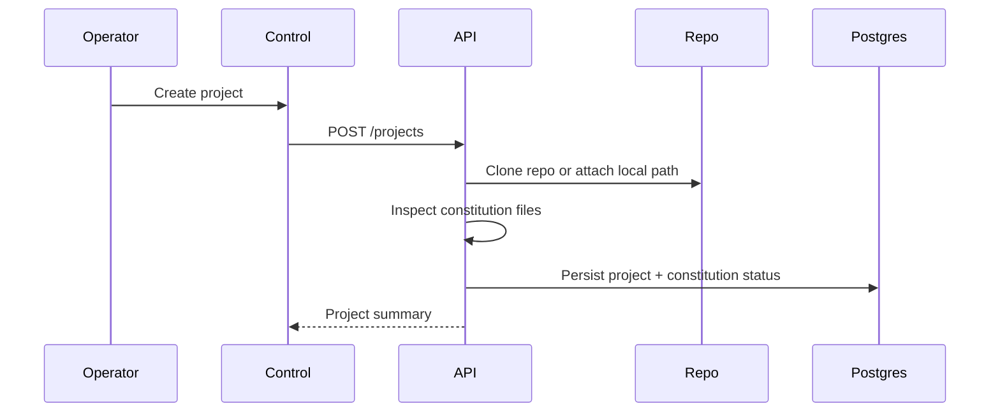
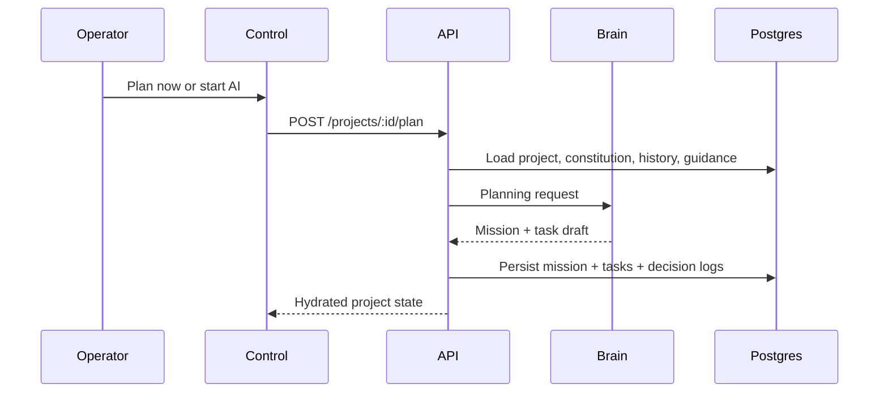
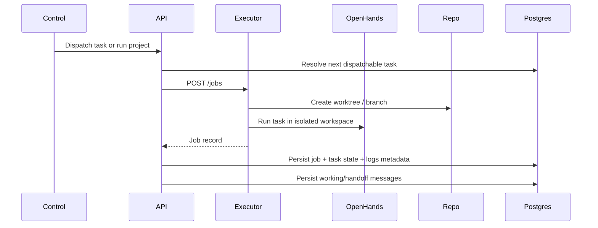
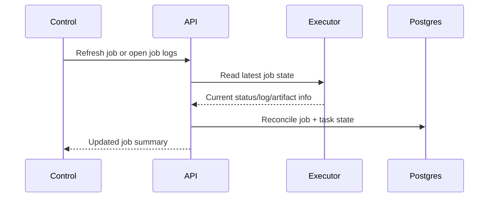
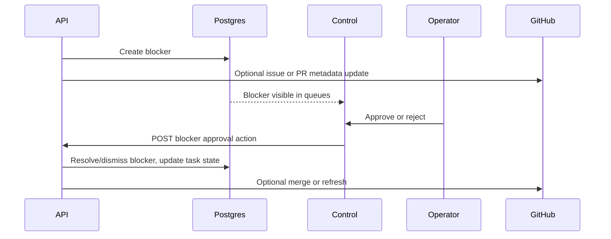
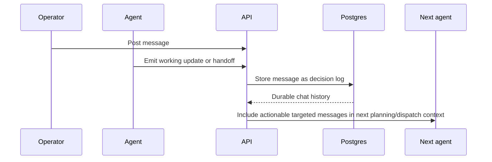
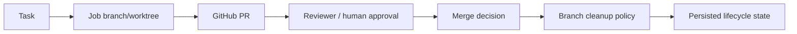
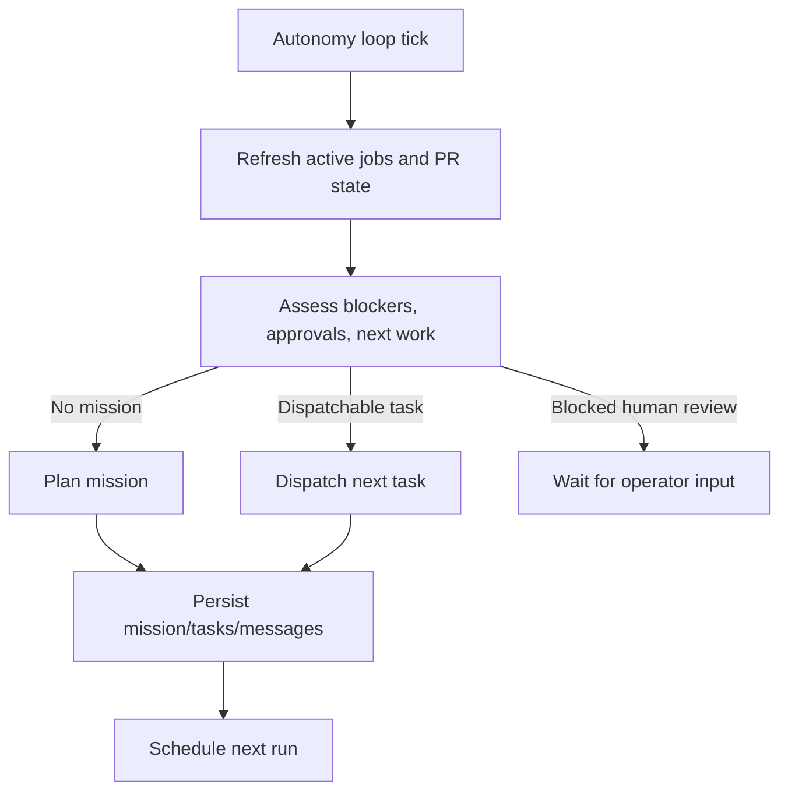

# yeet2 Data Flows

## Overview

This document describes the key runtime flows in yeet2 as implemented today.

## 1. Project Registration

What is persisted:

- project metadata
- repo location
- constitution inspection state
- default role definitions

## 2. Planning Flow

Inputs used by planning:

- constitution documents
- mission/task history
- configured staff roles and models
- actionable targeted guidance from project chat

Outputs:

- mission
- task list
- planning provenance
- handoff message for the next role

## 3. Execution Flow

Execution-side context includes:

- task details
- acceptance criteria
- targeted actionable guidance from project chat
- selected model for the assigned staff member

## 4. Job Refresh Flow

This keeps the control plane durable even when execution runs asynchronously.

## 5. Approval And Blocker Flow

Tickets are the main human escalation surface.

## 6. Project Chat Flow

Important rules:

- chat is durable in Postgres
- targeted messages can drive action
- broadcasts are visible but not automatically actionable
- replies inherit target context when no new mention is added

## 7. GitHub Artifact Flow

Persisted GitHub metadata includes:

- repo metadata
- compare links
- PR number/url/title/state
- merge state
- branch cleanup state

## 8. Autonomy Loop

The loop is intentionally conservative:

- it does not hide Brain failures
- it respects approval and merge policy
- it uses durable project state rather than transient session context
