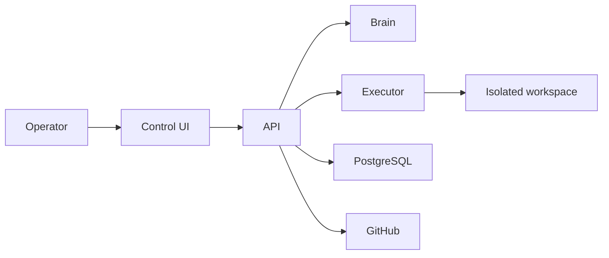

# yeet2

Self-hosted autonomous team platform. Define a project, attach a pipeline of specialist agents, and let yeet2 plan, execute, review, and ship — continuously.

## Current Release: v0.1.0-alpha

### What's Working

- [x] Project registration and constitution detection
- [x] Chat-driven constitution interview with LLM synthesis
- [x] Constitution editor with live markdown preview
- [x] 7-stage TDD pipeline: Architect → Implementer → Tester → Coder → QA → Reviewer
- [x] Autonomy modes: Manual, Supervised, Autonomous
- [x] Job execution via OpenHands in isolated git worktrees
- [x] Blocker creation, resolution, and approval workflows
- [x] Pull request creation and merge automation
- [x] QA/reviewer verdict recording
- [x] Stuck job recovery with configurable timeout
- [x] Markdown rendering and chatroom-style project chat
- [x] GitHub PAT management and 21 agent name themes
- [x] Docker deployment with health checks
- [x] 251+ tests across all services
- [x] CI/CD: typecheck, build, security scanning, GHCR publishing

### Beta Roadmap

**Agent Experience**
- [ ] Mission Control dashboard — real-time grid of all agents
- [ ] Live pipeline graph with animated handoffs
- [ ] Mid-task chat steering — talk to agents while they work
- [ ] Spatial agent visualization — characters in themed environments
- [ ] Execution trace timeline

**Platform**
- [ ] GitHub Projects + Issues kanban
- [ ] Pluggable execution adapters (passthrough, document, research)
- [ ] Visual flow editor (n8n-style) with loops and branching
- [ ] Pipeline templates for content, architecture, research, compliance
- [ ] Custom roles and role editor

See [Beta Spec](./BETA_SPEC.md) for full details.

## Runtime View

## Read This First

- [Get Started](./GETTING_STARTED.md) — first project walkthrough
- [Install](./INSTALL.md) — deployment guide
- [Vision](./VISION.md) — project purpose
- [Spec](./SPEC.md) — technical specification
- [Hermes Agent](./HERMES_AGENT.md) — external polling and trigger integration
- [Roadmap](./ROADMAP.md) — milestone breakdown

## System Reference

- [Architecture](./ARCHITECTURE.md)
- [Data Flows](./DATA_FLOWS.md)
- [Operations](./OPERATIONS.md)
- [Development](./DEVELOPMENT.md)
- [CI/CD](./CI_CD.md)
- [Decisions](./DECISIONS.md)
- [Beta Spec](./BETA_SPEC.md)
