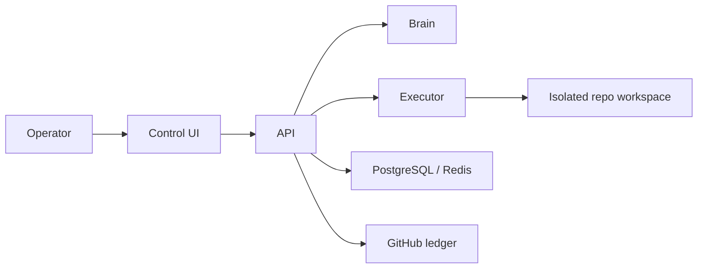

# yeet2

Self-hosted autonomous software-team platform.

yeet2 turns a project constitution into durable missions, tasks, execution jobs, blockers, approvals, and team chat, then keeps the work moving over time.

## Read This First

- [Vision](./VISION.md)
- [Spec](./SPEC.md)
- [Product Spec](./PRODUCT_SPEC.md)
- [Roadmap](./ROADMAP.md)

## System Reference

- [Architecture](./ARCHITECTURE.md)
- [Data Flows](./DATA_FLOWS.md)
- [Operations](./OPERATIONS.md)
- [Development](./DEVELOPMENT.md)
- [CI/CD](./CI_CD.md)
- [Decisions](./DECISIONS.md)

## Runtime View

## Current Focus

- clear operator control
- durable planning and execution state
- GitHub-native artifacts
- stronger execution safety over time
- dogfooding yeet2 on itself as `forgeyard`
